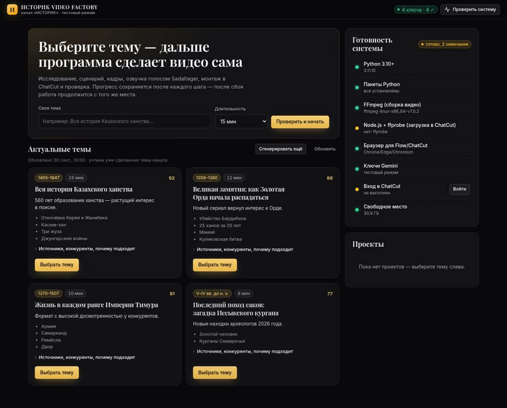
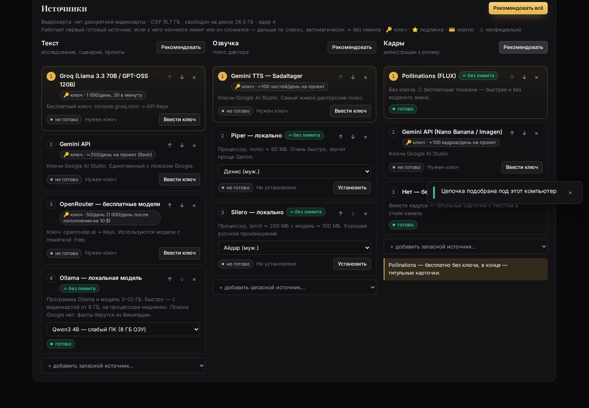
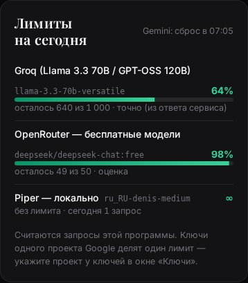
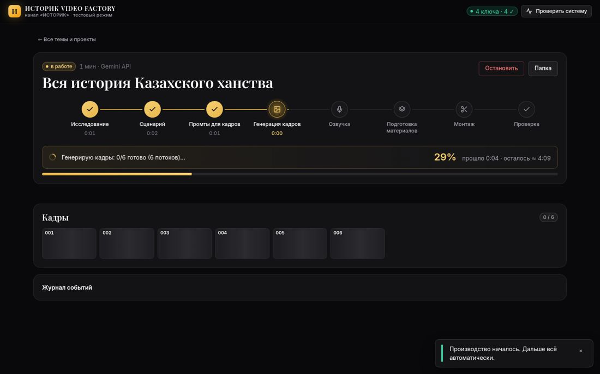

# ИСТОРИК VIDEO FACTORY

Локальный автономный конвейер производства исторических YouTube-видео для канала «ИСТОРИК».
Вы выбираете тему, программа делает всё остальное и в конце пишет **ГОТОВО**: исследование, сценарий, промты, кадры,
озвучку, монтаж в ChatCut, проверку и экспорт.

Каждую часть (текст, озвучку, кадры) можно делать разными способами: по ключу, без ключа, локально на своём компьютере,
по подписке. Способы выстраиваются в цепочку: кончился лимит у первого — работу сразу продолжает следующий
(см. [Источники](#источники-и-работа-без-лимитов)).



## Установка (Windows)

1. Установите Python 3.10+ с python.org и отметьте галочку «Add python.exe to PATH».
2. Откройте папку `istorik_factory`, в адресной строке Проводника наберите `cmd` и нажмите Enter.
3. Выполните команду:
   ```
   py install.py
   ```
   Установщик сам:
   - снимет блокировку скачанных файлов;
   - поставит пакеты, Chromium (если нет Chrome/Edge), Node.js и FFmpeg;
   - создаст на рабочем столе ярлык **«ИСТОРИК VIDEO FACTORY»** (запуск без окна консоли).
4. Запустите ярлык. Панель откроется в браузере (`http://127.0.0.1:8765`). Вставьте ключи Google AI Studio в окно «Ключи».

**Smart App Control / «Windows защитила компьютер».** Скачанные `.bat` Windows может блокировать. Способ выше
(`py install.py` → ярлык) запускает подписанный `python.exe`/`pythonw.exe` и не блокируется. Если нужно запустить `.bat`:
щёлкните по файлу правой кнопкой → «Свойства» → отметьте «Разблокировать» → «ОК». Можно снять блокировку со всей папки
одной командой в PowerShell: `Get-ChildItem -Recurse | Unblock-File`.

Другие способы запуска:
- двойной щелчок по `ИСТОРИК VIDEO FACTORY.pyw`;
- `ISTORIK_VIDEO_FACTORY.bat`;
- `.venv\Scripts\python run.py` — с консолью, видно журнал.

Программа не стартует, пока установка не закончена, и прямо об этом пишет (раньше в этом случае была ошибка
«No module named 'yaml'»). macOS и Linux: `python3 install.py`, затем `./istorik.sh`.

## Ключи Gemini

- В окне «Ключи» (кнопка в правом верхнем углу) вставьте сразу все ключи: через запятую, пробел или с новой строки.
  Лишний текст и комментарии отбрасываются. Ключи сохраняются в `.env` (он в `.gitignore`).
- Ключи используются по кругу:
  - ключ, у которого кончилась минутная квота (429), отдыхает столько, сколько сказал Google, а работа сразу идёт на следующем ключе;
  - при дневной квоте ключ отдыхает до сброса (полночь по тихоокеанскому времени);
  - неверный ключ (401/403) помечается и больше не используется. Панель показывает, например, «16 ключей: 9 ✓, 5 квота, 2 неверные» и умеет удалять неверные.
- Новые ключи `AQ.…` передаются заголовком `x-goog-api-key`. Если Google отвечает 401, программа пробует `Authorization: Bearer`.
  Если ключ не принимается ни так, ни так (известная проблема части ключей AQ.), программа объясняет, что делать.
- Если квота кончилась на всех ключах, вы сразу увидите сообщение «Квота исчерпана на всех ключах — сброс примерно в ЧЧ:ММ»,
  без бесконечного ожидания.

## Что изменилось в этой версии

| Было | Стало |
|---|---|
| Весь `GEMINI_API_KEY` с русским текстом уходил в HTTP-заголовок (`UnicodeEncodeError`) | Из строки берутся только ключи (`AIza…`/`AQ.…`), в заголовок попадает только ASCII |
| Использовался только первый ключ; 429 — часами в ретраях | Потокобезопасный пул ключей со статусами ok / квота до времени / неверный; ротация без ожидания |
| 401 на одном ключе ронял всю стадию | Неверный ключ помечается, работа продолжается на остальных |
| Прописанные модели `gemini-2.5-*` дают 404 | Модели выбираются по ListModels (кэш на сутки в `data/models.json`). Мусор (customtools, exp, live, preview при наличии стабильной) отфильтрован. Модель с 404 исключается навсегда |
| `Timeout(600)`, бесконечные ожидания | 10 с на соединение, ≤ 90 с на запрос, ≤ 240 с на вызов со всеми повторами. Сторож перезапускает шаг без прогресса |
| Модель «думала» минутами | `thinkingLevel=minimal/low` (3.x) или `thinkingBudget` (2.x), для JSON мышление минимальное, структурированный вывод через `responseSchema` |
| Этапы шли последовательно | Параллельно: 4 прохода исследования, главы, батчи промтов, кадры (6 потоков), части озвучки. Число потоков ограничено числом живых ключей |
| Прогресс сохранялся по этапам | Сохраняется после каждого подзадания (проход, глава, батч, кадр, часть голоса). Дисковый кэш ответов для перезапусков |
| Темы не появлялись, ошибки молча | Поиск тем запускается сам при старте, ход поиска и ошибки видны в панели, есть кнопка «Сгенерировать ещё». Без ключа YouTube поиск идёт через Gemini + Google Search |
| Название «Вся История Россий» бралось как есть | Название исправляется автоматически, варианты предлагаются в окне старта |
| Опрос сервера каждые 1,5 с, `alert()` | События SSE `/api/events` (нагрузки в простое нет), тосты, диалоги, отмена удаления |
| Нет журнала приложения | `logs/app.log` с ротацией (5 × 5 МБ), журналы проекта в `08_logs/` |

Для заглядывания внутрь: `python run.py --selftest` — проверка системы за 1–2 минуты; `python run.py --smoke` — реальный
1-минутный ролик с вашими ключами и замером времени каждого этапа (пишется в `REPORT.txt` проекта).

## Источники и работа без лимитов

Карточка **«Источники»** на главной странице панели. Для каждой части — текст, озвучка, кадры — там **цепочка** источников:

- работает первый готовый источник;
- если у него кончился лимит, не принят ключ, он не запущен или пропала сеть, работа сразу продолжается на следующем.
  В панели появится уведомление «Переключаюсь на …», а у источника будет написано, до какого времени он пропускается;
- порядок меняется стрелками ↑ ↓, источник убирается крестиком, запасной добавляется списком «+ добавить запасной источник»;
- кнопка **«Рекомендовать»** (для части) или **«Рекомендовать всё»** подбирает цепочку, наиболее близкую к безлимиту,
  для этого компьютера. Учитываются видеокарта и её память, ОЗУ, образец голоса, подписка Flow и введённые ключи;
- всё, что нужно ставить (Ollama и модели, Piper, Silero/torch, Chatterbox, ComfyUI с моделью), ставится кнопкой
  **«Установить»** прямо в карточке. Прогресс виден там же, при ошибке показано, что сделать. Прерванное скачивание
  продолжается с места остановки.



Пометки: **∞ без лимита** · **🔑 ключ · лимит N/день** · **⭐ подписка** · **💳 платно** · **⚠ неофициально** (не включается по умолчанию).

### Текст — исследование, сценарий, промты

| Источник | Пометка | Лимит | Что нужно | Как включить |
|---|---|---|---|---|
| Gemini API | 🔑 | ≈250 запросов/день на проект (flash) | ключи Google AI Studio | «Ключи». Единственный источник с поиском Google |
| Groq (Llama 3.3 70B, GPT-OSS 120B) | 🔑 | 1 000/день на модель, 30/мин | бесплатный ключ console.groq.com | «Ключи» → Groq |
| OpenRouter, бесплатные модели `:free` | 🔑 | 50/день (1 000/день после разового пополнения на 10 $) | ключ openrouter.ai | «Ключи» → OpenRouter |
| Mistral | 🔑 | по бесплатному плану Experiment | ключ console.mistral.ai | «Ключи» → Mistral |
| Cerebras (GPT-OSS 120B) | 🔑 | пробные кредиты | ключ cloud.cerebras.ai | «Ключи» → Cerebras |
| Ollama — локальная модель | ∞ | нет | Ollama + модель 3–20 ГБ; быстро с видеокартой от 8 ГБ | «Установить»; модель подбирается по видеокарте (Qwen3 32B/14B/8B/4B) |
| Gemini с оплатой | 💳 | тысячи запросов в день | проект Google Cloud с оплатой | см. ниже; ключ — в «Ключи» → «Gemini с оплатой» |

Поиск Google есть только у Gemini. Остальным источникам программа сама подкладывает факты из Википедии (официальный
API, ru + en, со ссылками), а при желании — из вашего SearXNG (`searxng_url`). Поиск тем ограничен 90 секундами.
Если источник не успел, панель покажет ошибку и кнопки **«Искать через другой источник»**.

### Озвучка

| Источник | Пометка | Что нужно | Качество |
|---|---|---|---|
| Gemini TTS, голос Sadaltager | 🔑 ≈100 частей/день на проект | ключи Google AI Studio | самый живой дикторский голос |
| Piper — локально | ∞ | процессор, голос ≈ 60 МБ | быстро (8 с речи за 1,7 с на слабом процессоре), звучит проще |
| Silero — локально | ∞ | процессор, torch ≈ 200 МБ + модель ≈ 100 МБ | хорошее русское произношение и ударения |
| Chatterbox — ваш голос | ∞ | образец голоса 10–30 с, видеокарта NVIDIA от 8 ГБ | клонирование голоса, лицензия MIT |
| Microsoft Edge TTS | ⚠ неофициально | пакет edge-tts | хорошие голоса, но может перестать работать |
| Нет — без озвучки | ∞ | — | тишина расчётной длины, таймкоды и субтитры сохраняются |

Цифры для локальных голосов переводятся в слова («1465» → «тысяча четыреста шестьдесят пять»). Если источник сменился
посреди ролика, все части переозвучиваются одним голосом (`voice_uniform`). Если Hugging Face недоступен, голос Piper
скачивается с официального релиза на GitHub.

Почему не XTTS и не F5-TTS: у XTTS лицензия Coqui Public Model License, у весов F5-TTS — CC BY-NC. Обе запрещают
коммерческое использование, а канал монетизирован. Chatterbox Multilingual выпущен под MIT и умеет русский.

### Кадры

| Источник | Пометка | Что нужно | Скорость |
|---|---|---|---|
| Gemini API (Nano Banana / Imagen) | 🔑 ≈100 кадров/день на проект | ключи | параллельно, 6 потоков |
| Google Flow | ⭐ подписка Google AI Pro/Ultra | вход в Google в окне программы | по одному кадру |
| ComfyUI — локально (FLUX.1 schnell / SDXL) | ∞ | видеокарта NVIDIA от 8 ГБ, 10–25 ГБ на диске | 5–20 с на кадр |
| Pollinations (FLUX) | ∞ | ничего; токен необязателен | ≈1 кадр в 15 с |
| Hugging Face (FLUX.1 schnell) | 🔑 небольшой кредит в месяц | бесплатный токен | быстро, пока есть кредит |
| Нет — без картинок | ∞ | — | титульные карточки с текстом в стиле канала |

ComfyUI ставится кнопкой: портативная сборка с GitHub плюс модель. При видеокарте от 12 ГБ берётся FLUX schnell,
от 8 ГБ — SDXL.

### Что выбрать

- **Мощная видеокарта (от 12 ГБ):** Ollama (Qwen3 14B) → Gemini; Silero/Piper; ComfyUI FLUX → Pollinations. Работает без лимитов.
- **Обычный ПК без видеокарты:** Gemini → Groq → OpenRouter → Ollama (Qwen3 4B/8B, медленно); Silero или Piper; Flow по подписке → Pollinations → титульные карточки.
- **Все ключи Gemini исчерпаны:** включите Groq (1 000 запросов в день бесплатно), озвучку Piper/Silero, кадры Flow/Pollinations.
  Ролик соберётся без Gemini.

Проще всего нажать **«Рекомендовать всё»**: программа выберет сама, а в карточке объяснит почему.

### Лимиты

Карточка **«Лимиты на сегодня»**:

- **Gemini.** Показывается по моделям и по проектам Google: процент остатка, «осталось N из M» и время сброса
  (полночь по тихоокеанскому времени). Ключи одного проекта делят один лимит. Подпишите в окне «Ключи», из какого
  проекта каждый ключ, например «Аккаунт 1 / A». Когда у проекта кончается дневная квота, программа сразу переходит к
  ключам другого проекта. Лимит **точный**, если Google сообщил его в ответе 429, иначе это **оценка**. Остаток квоты
  Google не отдаёт, поэтому считаются запросы этой программы.
- **Groq, Cerebras, Mistral.** Точный остаток из заголовков ответа (`x-ratelimit-remaining-requests`).
- **OpenRouter.** Оценка: 50 запросов в день.
- **Локальные источники.** «∞» и число запросов за сегодня.



### Gemini с оплатой — как включить

1. console.cloud.google.com → выберите проект (или создайте новый) → **Billing** → привяжите платёжный аккаунт.
2. aistudio.google.com → **Get API key** → создайте ключ в этом проекте. В списке ключей у проекта должно быть написано
   «Paid» / Tier 1.
3. В панели: «Ключи» → **«Gemini с оплатой»** → вставьте ключ. В «Источниках» добавьте «Gemini с оплатой» в цепочку
   текста запасным.
4. Поставьте лимит расходов: Billing → Budgets & alerts. 10-минутный ролик обходится примерно в 0,05–0,5 $ за текст.

### Что программа не делает

Используются только официальные API и открытые модели. Программа не обходит CAPTCHA, не создаёт аккаунты, не пользуется
«серыми» реверс-API чужих сайтов и не автоматизирует gemini.google.com вместо API. Неофициальный Edge TTS помечен ⚠ и
по умолчанию выключен. Ключи и токены хранятся только в `.env` и `data/`, оба в `.gitignore`.

### Проверка источников вживую

```
python run.py --selftest            # живой запрос к каждому источнику текста из цепочки
python run.py --smoke keyless       # 1-минутный ролик «всё без ключей»: Ollama, Piper/Silero, ComfyUI/Pollinations
python run.py --smoke gemini        # 1-минутный ролик «Gemini + запасные»
```

Время каждого этапа и какие источники сработали, пишется в `REPORT.txt` проекта.

## Панель

- **Готовность системы.** Пакеты, FFmpeg, Node.js/ffprobe, браузер, ключи, модели, вход в ChatCut и Flow. У красных пунктов
  есть кнопка «Исправить».
- **Актуальные темы.** Кнопки «Выбрать тему», «Сгенерировать ещё» и поле «Своя тема» с проверкой названия.
- **Производство.** Живой конвейер из 8 шагов:
  - у каждого шага свой таймер;
  - бегущая строка текущей операции («Генерирую кадры: 37/120 готово…»), общий процент и оценка оставшегося времени;
  - миниатюры кадров появляются по мере генерации, волна озвучки с прослушиванием.
- **ГОТОВО.** Превью видео и кнопки «Открыть MP4», «Открыть в ChatCut», «Папка проекта».
- **Проекты.** Карточки с обложкой: «Продолжить» и «Удалить». Удаление переносит проект в `projects/_deleted`, в тосте есть кнопка «Отменить».



## Возобновление

После сбоя, перезагрузки или остановки откройте проект и нажмите **«Продолжить проект»**. Работа продолжится с незавершённого
подзадания, например с кадра 38 из 120; готовые кадры, главы и части голоса не переделываются. Старые проекты тоже продолжаются.

```
python run.py --list
python run.py --resume 2026-09-30_vsya-istoriya-...
python run.py --resume <id> --from-stage voice      # переделать с этапа
python run.py --topic "Вся история Казахского ханства" --minutes 15   # FULL AUTO без панели
```

## Настройки

- `config.yaml`:
  - `turbo`: параллельность;
  - `llm`: таймауты, мышление, закрепление моделей;
  - `pipeline`: сторож;
  - темп речи, кадры на слова, голос, переходы, субтитры, ChatCut.
- `channel/profile.yaml`: ниша, стиль сценария, визуальный стиль, конкуренты, опубликованные темы (пополняются автоматически).
- `.env`: ключи. Описание — в `.env.example`.

## Тесты

```
python -m pytest -q tests
```

Около 140 тестов. Все сетевые ответы имитируются, внешняя сеть не нужна.

| Файл | Что проверяет |
|---|---|
| `tests/test_providers.py` | **Маршрутизатор и отказы:** 429 на всех ключах, 401/403, таймаут, Ollama не запущена, ComfyUI не запущен, нет интернета. Каждый случай — переключение или понятная ошибка за ограниченное время. **Источники на имитации сети:** Groq/OpenRouter/Mistral/Cerebras (точные лимиты из заголовков, только бесплатные модели), Ollama, Википедия, Pollinations, Hugging Face, ComfyUI, Piper/Silero/Chatterbox/Edge. **«Рекомендовать»:** по видеокарте. **Сочетания:** все 36 пар озвучка × кадры с разными источниками текста — офлайн до «ГОТОВО». **Смена источника посреди работы:** остановка на озвучке Gemini, продолжение на Piper. **API панели, установщики:** докачка, понятные ошибки, настоящая установка edge-tts |
| `tests/test_llm.py` | 429 на первом ключе, 401 на половине ключей, ключи AQ., 404 модели, таймаут, пустой ответ, битый JSON, квота на всех ключах, гонки 10 потоков при отключении ключей |
| `tests/test_resilience.py` | 10 полных офлайн-прогонов подряд; `kill -9` на каждом из 8 этапов и продолжение с того же места (готовое не переделывается); корзина; проекты старого формата |
| `tests/test_ui.py` | Playwright на ширине 1440 и 390: все экраны, а также карточки «Источники» и «Лимиты» во всех состояниях — установка с прогрессом, ошибка установки, «в лимите до …», «Рекомендовать», смена порядка, точный лимит / оценка / ∞, окно ключей, «Искать через другой источник». 0 ошибок в консоли, без горизонтальной прокрутки |
| `tests/test_factory.py` | Сборка таймлайна ChatCut на имитации MCP, автоматизация Flow на имитации страницы, MCP-клиент |

Правила дизайна, по которым сделана панель, лежат в `.claude/skills/`:
- Vercel Web Interface Guidelines;
- скиллы анимаций Эмиля Ковальски;
- Anthropic frontend-design и webapp-testing.

Лицензии MIT и Apache 2.0.
